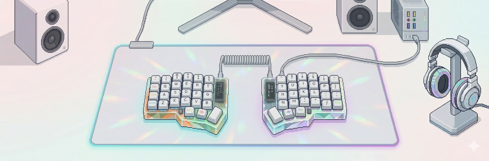

    <h1>Learn, again and again and again🌱</h1>

<picture>
  <source
    srcset="./img/CorneBannerFinal.png"
    media="(prefers-color-scheme: dark)"
  />
  <source
    srcset="./img/CorneBannerFinalLight.png"
    media="(prefers-color-scheme: light), (prefers-color-scheme: no-preference)"
  />
  
</picture>

 

  <!-- <h3>📧 Contact</h3> -->
  

    
    
  

 

 

  
    <strong style="font-size: 17px;">👋 Fullstack Developer | AI, ML & DL Enthusiast</strong>
     
    Passionate about algorithms, scalable systems, and intelligent software
  
   
   
  

    I'm a developer passionate about solving complex problems through algorithms and software design. 
    I work mainly in the full-stack ecosystem, building scalable applications with modern technologies. My main interest is Artificial Intelligence and Deep Learning, where I enjoy exploring neural networks, optimization techniques, and intelligent systems.
  

 

  <h3>🚀 Languages</h3>
  

 

  <h3>⚡ Frameworks</h3>
  

 

  <h3>⚒️ Tools</h3>
  

 

  <h3>👨‍💻 Currently working with</h3>
  

 

  <h3>💻 What I'm doing</h3>
    <article><strong>Fullstack:</strong> Building scalable and efficient applications</article>
    <article><strong>AI/ML/DL:</strong> Experimenting with neural networks and algorithm optimization</article>
    <article><strong>Algorithmics:</strong> Solving logical challenges and improving code efficiency</article>

 

 

  <h3>📊 My stats</h3>
   
  <a href="https://github.com/anuraghazra/github-readme-stats">
    <picture>
      <source
        srcset="https://github-readme-stats.vercel.app/api?username=brauliogrc&show_icons=true&theme=aura"
        media="(prefers-color-scheme: dark)"
      />
      <source
        srcset="https://github-readme-stats.vercel.app/api?username=brauliogrc&show_icons=true"
        media="(prefers-color-scheme: light), (prefers-color-scheme: no-preference)"
      />
      
    </picture>
  </a>
  <a href="https://github.com/anuraghazra/convoychat">
    <picture>
      <source
        srcset="https://github-readme-stats.vercel.app/api/top-langs/?username=brauliogrc&theme=aura&layout=compact"
        media="(prefers-color-scheme: dark)"
      />
      <source
        srcset="https://github-readme-stats.vercel.app/api/top-langs/?username=brauliogrc&layout=compact"
        media="(prefers-color-scheme: light), (prefers-color-scheme: no-preference)"
      />
      
    </picture>
  </a>

 
 
 

<!-- 
**brauliogrc/brauliogrc** is a ✨ _special_ ✨ repository because its `README.md` (this file) appears on your GitHub profile.

Here are some ideas to get you started:

- 🔭 I’m currently working on ...
- 🌱 I’m currently learning ...
- 👯 I’m looking to collaborate on ...
- 🤔 I’m looking for help with ...
- 💬 Ask me about ...
- 📫 How to reach me: ...
- 😄 Pronouns: ...
- ⚡ Fun fact: ... 

https://shields.io/badges
https://github.com/alexandresanlim/Badges4-README.md-Profile/blob/master/README.md
https://gist.github.com/rxaviers/7360908
-->

